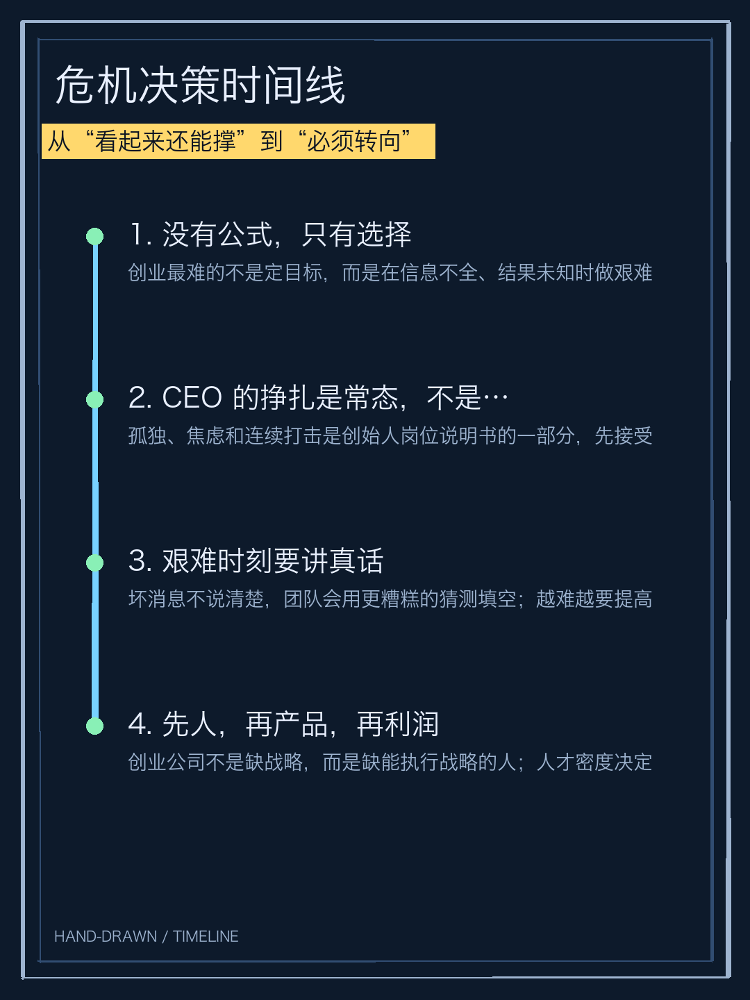
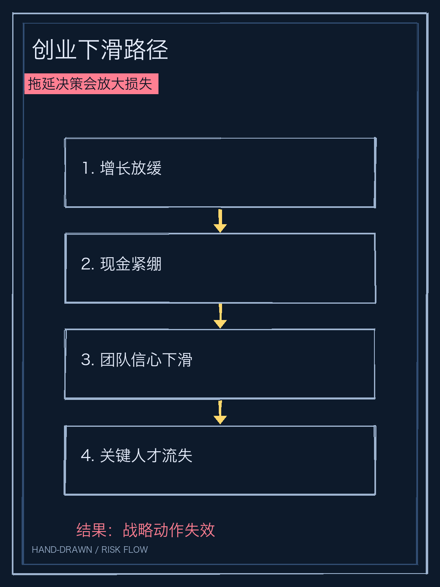
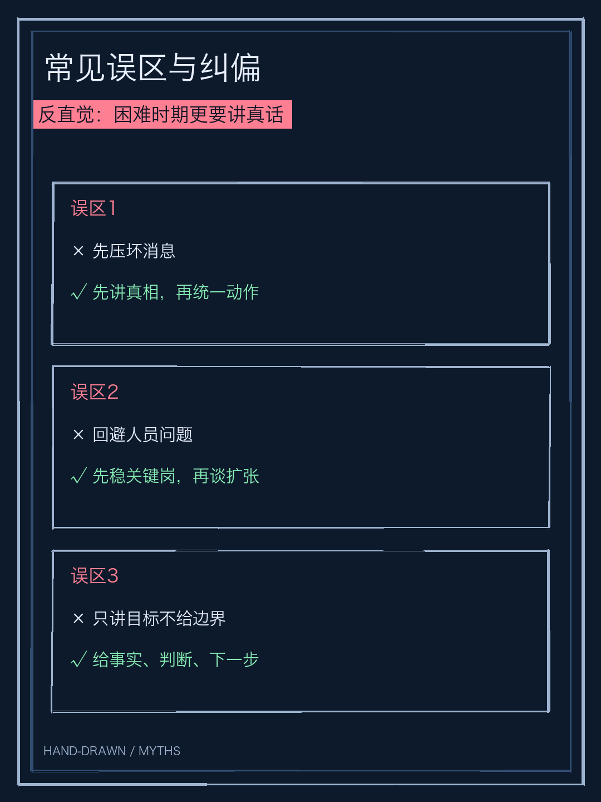
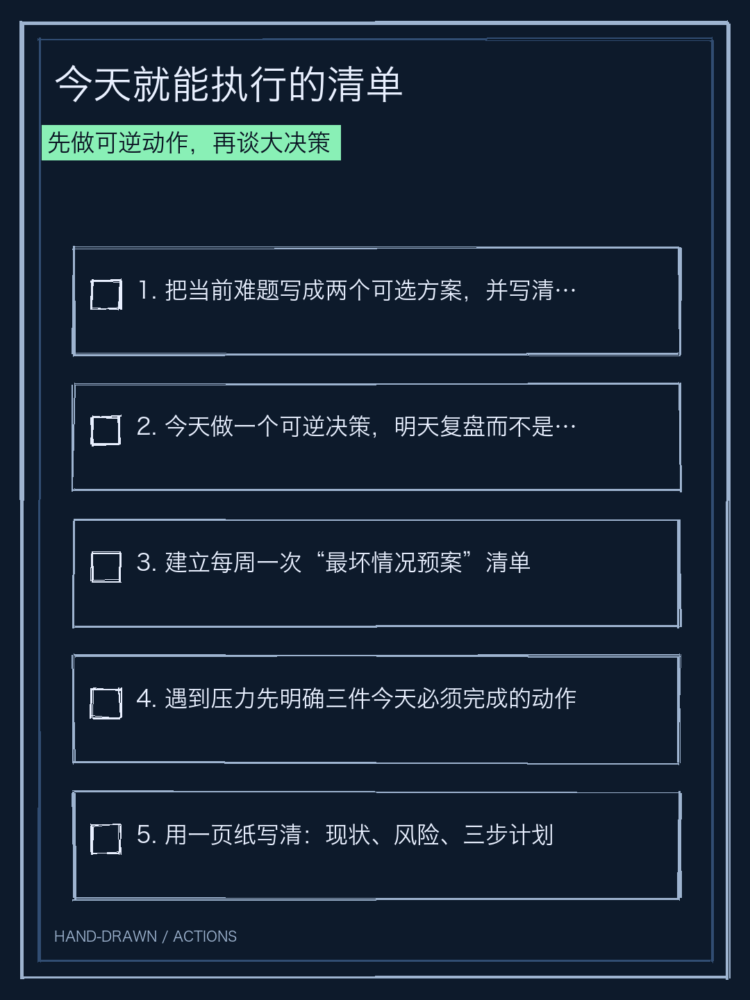
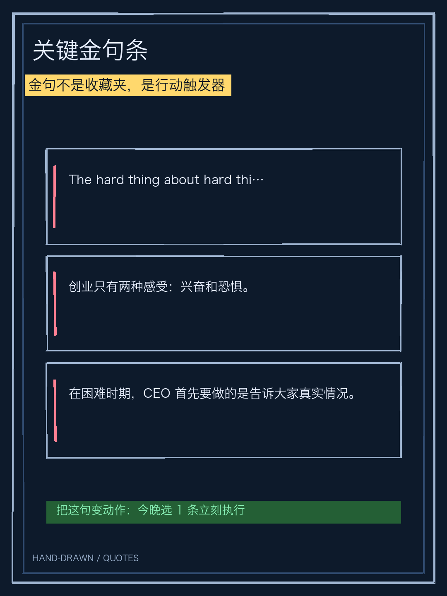

## 创业维艰｜10张决策卡
困难时刻，不找标准答案，只选可承受解。

---

## 卡片2｜为什么现在必须读
- 这本书不是成功学，而是高压期生存手册。
- 当团队焦虑、节奏混乱时，它给的是可执行动作。

---

## 卡片3｜洞见1
- 最难的不是定目标，而是扛后果。
- 先问：最坏情况能否承受？
- 再问：有没有可逆路径？

---

## 卡片4｜洞见2
- CEO 的情绪稳定，是组织稳定器。
- 危机优先级：现金流 > 核心人 > 客户信心。
- 先稳节奏，再谈增长。

---

## 卡片5｜洞见3
- 坏消息不说清楚，团队会用更糟猜测填空。
- 固定话术：事实 + 判断 + 下一步。
- 透明不是情绪化，是给确定性。

---

## 卡片6｜关键案例
- 与其拖着乐观，不如尽早做艰难但正确的决定。
- 先做可逆动作止损，再争取下一步主动权。

---

## 卡片7｜常见误区反驳
- 误区：先压坏消息，等情况好点再说。
- 纠偏：先讲清真相，再统一动作，组织才会稳。

---

## 卡片8｜方法步骤
- 步骤1：写下当前最硬问题。
- 步骤2：列 2 个方案，并写清代价边界。
- 步骤3：24 小时内执行一个可逆动作并复盘。

---

## 卡片9｜今日行动清单
- [ ] 写下当前难题与代价边界
- [ ] 今天做一个可逆决策
- [ ] 同步一次“事实 + 下一步”

---

## 卡片10｜金句 + CTA
> The hard thing about hard things is there is no formula.
- 收藏这组卡，今晚从第9张里选1条执行。

