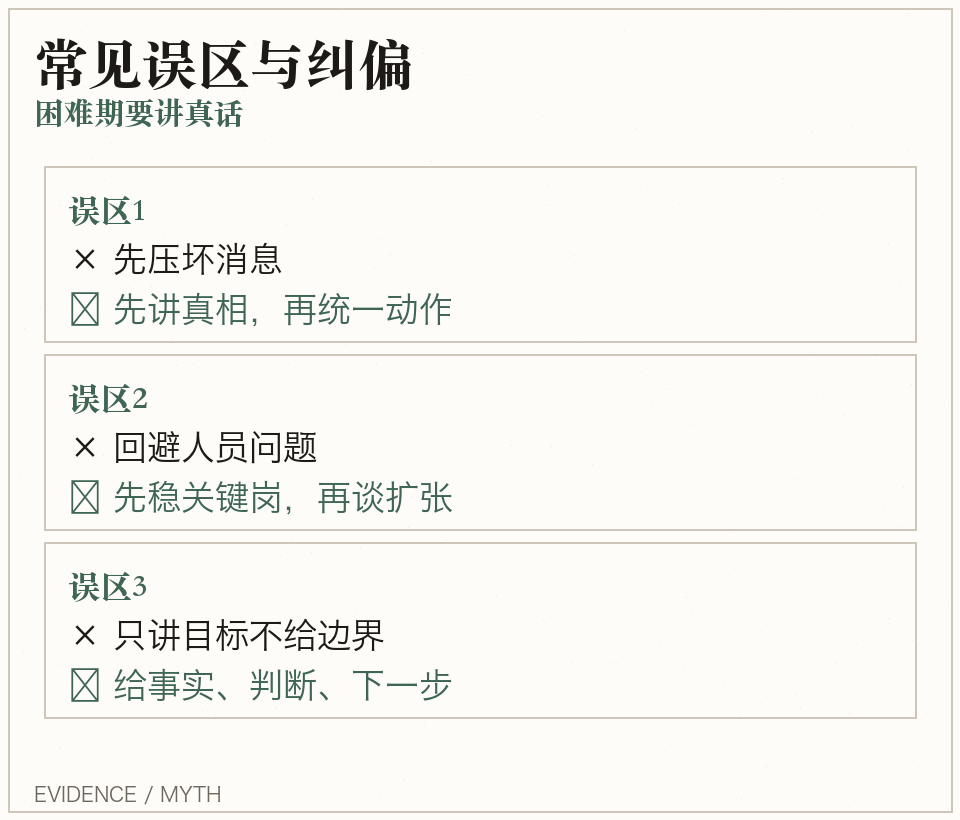

## 创业维艰（The Hard Thi…｜10张决策卡
困难时刻，不找标准答案，只选可承受解。

---

## 卡片2｜为什么现在必须读
- 这本书不是成功学，而是高压期生存手册。
- 当你团队焦虑、节奏混乱时，它给的是“可执行动作”。

---

## 卡片3｜洞见1
- 核心结论：创业最难的不是定目标，而是在信息不全、结果未知时做艰难决策并承担后果。
- 决策标准：先问“最坏情况能否承受”。
- 关键提醒：管理书给的是方法论，真实世界要处理动态冲突

---

## 卡片4｜洞见2
- 核心结论：孤独、焦虑和连续打击是创始人岗位说明书的一部分，先接受现实才能做对决策。
- CEO 的情绪稳定，是组织稳定器。
- 危机优先级：现金流 > 核心人 > 客户信心。

---

## 卡片5｜洞见3
- 核心结论：坏消息不说清楚，团队会用更糟糕的猜测填空；越难越要提高信息透明度。
- 困难时期沉默会放大恐慌，沟通要给确定性。
- 固定话术：事实是什么 + 判断是什么 + 下一步是什么。

---

## 卡片6｜关键案例
- 案例结论：作者多次在融资、裁员、业务转向中没有标准答案，只能在更坏和没那么坏之间做取舍。
- 不是等“完美答案”，而是先做可逆动作止损。

---

## 卡片7｜常见误区反驳
- 误区：先压坏消息，等情况好点再说。
- 纠偏：先讲清真相，再统一动作，组织才会稳。

---

## 卡片8｜方法步骤
- 步骤1：写下当前最硬问题。
- 步骤2：列出 2 个方案，并写清代价边界。
- 步骤3：24 小时内执行一个可逆动作并复盘。

---

## 卡片9｜今日行动清单
- [ ] 把当前难题写成两个可选方案，并写清代价
- [ ] 今天做一个可逆决策，明天复盘而不是拖延
- [ ] 建立每周一次“最坏情况预案”清单

---

## 卡片10｜金句 + CTA
> The hard thing about hard things is there is no formula.
- 收藏这组卡，今晚从第 9 张里选 1 条执行。

